# Presentation
  1. [분석 주제 및 목표](#1-분석-주제-및-목표)
  2. [데이터 탐색](#2-데이터-탐색)
  3. [데이터 전처리](#3-데이터-전처리)
  4. [데이터 시각화](#4-데이터-시각화)
  5. [그래프 분석](#5-그래프-분석)
  6. [상관관계 분석](#6-상관관계-분석)
  7. [분석 결과](#7-분석-결과)

---
---

## 1. 분석 주제 및 목표

### 1-1. 분석 주제

<br>

> ### **날씨 변화에 따른 배달 소비 성향 분석**

---

### 1-2. 분석 목표

<br>

> **배달 주문횟수와 날씨와의 상관관계 분석**
   - 매우 덥거나 추운 날에 배달 주문횟수가 증가하는가?
   - 비가 오는 날에 배달 주문횟수가 증가하는가?
   - 음식 분류 별 주문횟수와 날씨와의 상관관계에 유의미한 차이가 발생하는가?

> **코로나19가 배달 주문횟수와 날씨 간의 상관관계에 영향을 끼쳤는지 분석**
   - 코로나19 이후 배달 주문이 일상이 되었다는 가설을 증명하기 위한 목적
   - 코로나19 이전에 배달 주문횟수와 날씨와의 상관관계가 있다고 가정할 때,   
     코로나19 이후에 상관관계에 변화가 발생하는가?

---
---

## 2. 데이터 탐색

### 2-1. KT 통신 빅데이터 플랫폼
- [업종 목적지별 배달 주문건수](https://bdp.kt.co.kr/invoke/SOKBP2603/?goodsCode=KGUDSTNORDER)

<br>

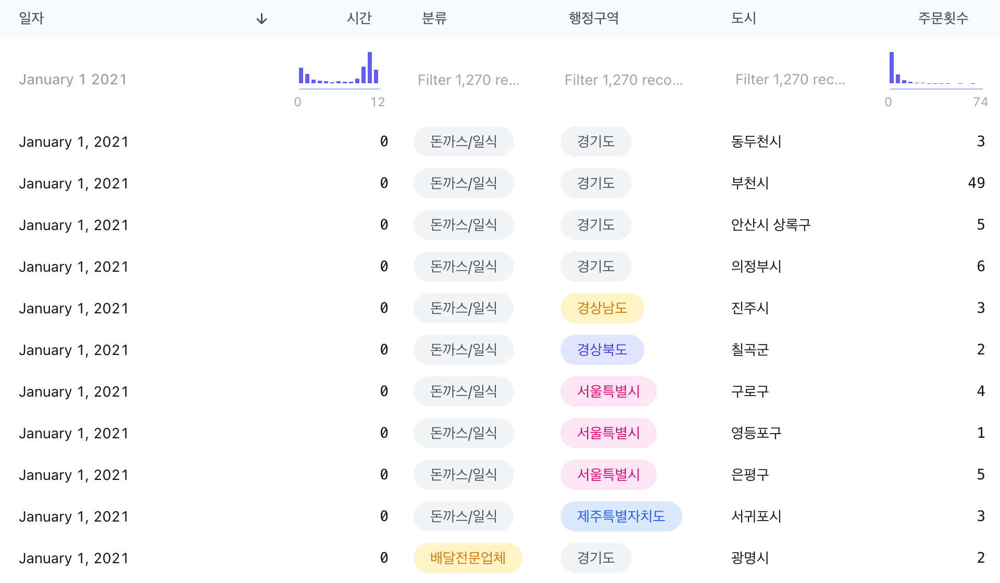

---

### 2-2. 기상청 기상자료개방포털
- [종관기상관측(ASOS)](https://www.bigdata-environment.kr/user/main.do)

<br>

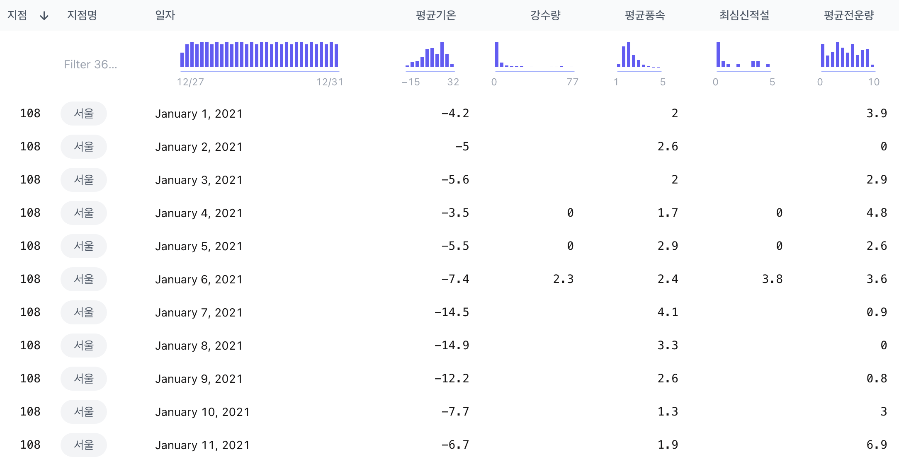

---
---

## 3. 데이터 전처리

### 3-1. 기존 데이터 vs 필요한 데이터 비교
1. 지역을 서울특별시에 한정했기 때문에 행정구역이나 도시 등의 정보가 필요없음
2. 데이터의 단위를 하루로 맞췄기 때문에 시간 정보가 필요없음
3. 연단위의 데이터는 너무 크기 때문에 필요한 기간의 데이터만 잘라 볼 필요가 있음
4. 배달 데이터에서 하나의 열에 묶여있는 분류를 각각의 열로 분리할 필요가 있음
5. 시각화 시 한글 폰트를 적용하는게 원활하지 않아 모든 한글 목차를 영어로 변환
6. 시각화 시 x축 데이터인 일자가 너무 길게 늘어서서 불필요한 연도 부분을 제거

---

### 3-2. 배달 데이터 전처리

<br>

> **원본 데이터에서 지역 및 기간을 한정해 추출**

```python
def make_seoul_delivery(origin_df, start_date, end_date) -> pd.DataFrame:

    seoul_df = origin_df[ origin_df['행정구역'] == '서울특별시' ]
    seoul_df = pd.pivot_table(seoul_df, index=['행정구역', '일자', '분류'], aggfunc=np.sum)
    seoul_df = seoul_df.reset_index()
    del seoul_df['행정구역']
    del seoul_df['시간']

    seoul_df = detach_year(seoul_df)
    seoul_df = seoul_df.set_index('일자')
    
    return seoul_df.loc[start_date : end_date]
```

<ul>
    <li>함수는 (1)원본 데이터프레임, (2)시작 일자, (3)종료 일자를 받음</li>
    <li>우선 '행정구역'이 '서울특별시'인 데이터를 추출해서 지역변수로 선언</li>
    <li>추출된 데이터에서 인덱스를 '행정구역'으로 설정하고 '일자', '분류' 순으로 데이터를 통합</li>
    <li>불필요한 '행정구역' 및 '시간' 행을 제거</li>
    <li>시작 일자부터 종료 일자 사이 기간에 해당하는 데이터를 추출해서 반환</li>
    <br>
    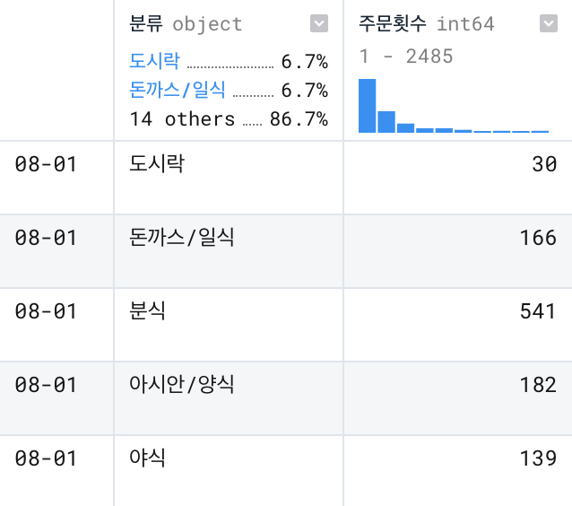
</ul>
<br>

> **1차 처리된 데이터에서 '분류' 열을 각각의 열로 분리**

```python
def count_by_category(origin_df, sum_df, categories) -> pd.DataFrame:

    counting_df = sum_df.copy()

    for category in categories:
        each_delivery = origin_df[ origin_df['분류'] == category ].copy()
        del each_delivery['분류']
        each_delivery.rename(columns={'주문횟수':category}, inplace=True)
        counting_df = counting_df.join(each_delivery)

    counting_df = counting_df.fillna(0)

    return counting_df
```

<ul>
    <li>함수는 (1)데이터프레임, (2)'총주문횟수' 열만 가지고 있는 데이터프레임, (3)'분류' 목록을 받음</li>
    <li>2번 데이터프레임의 사본을 <code>join</code> 연산의 바탕이 되는 템플릿으로 지정</li>
    <li>각각의 '분류' 목록에 대해 반복문을 진행하며 해당하는 데이터만을 추출</li>
    <li>추출한 데이터프레임의 '분류' 열 이름을 변경하고 템플릿과 병합하는 과정을 반복</li>
    <li>각각의 열로 분리된 데이터프레임에서 결측치를 0으로 설정하고 반환</li>
    <br>
    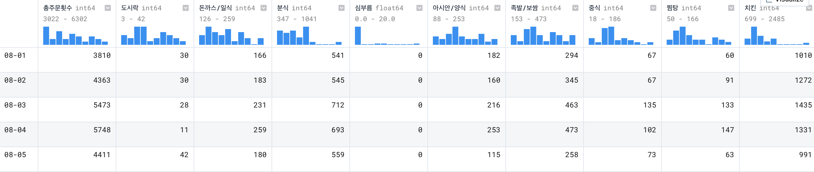
</ul>
<br>

> **2차 처리된 데이터에서 한글 목차를 영어로 변환**

```python
def rename_kor_to_eng(origin_df) -> pd.DataFrame:

    renamed_df = origin_df.copy()

    en_dictionary = dict() # 딕셔너리 내용 생략

    renamed_df.rename(columns=en_dictionary, inplace=True)
    renamed_df.index.name = 'date'

    en_categories = list(en_dictionary.values())
    en_categories = [en_categories[0]] + sorted(en_categories[1:])
    renamed_df = renamed_df.reindex(columns=en_categories)

    return renamed_df
```

<ul>
    <li>함수는 (1)한글 데이터프레임을 받음</li>
    <li>한글 데이터프레임 사본의 목차를 미리 지정한 한영 사전과 매칭시켜 변환</li>
    <li>한글 순으로 정렬된 목차를 영어 순서대로 정렬하고 반환</li>
    <br>
    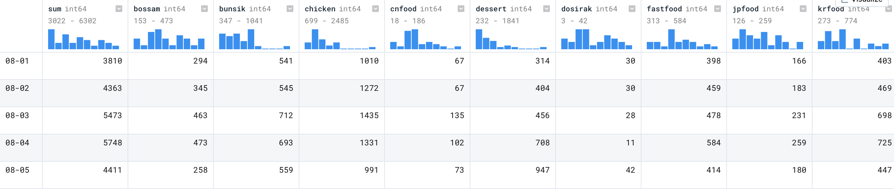
</ul>

---

### 3-3. 날씨 데이터 전처리

<br>

> **원본 데이터에서 불필요한 행과 열을 제거**

```python
def clean_up_data(origin_df, start_date, end_date) -> pd.DataFrame:

    weather_df = origin_df.copy()

    del weather_df['지점']
    del weather_df['지점명']
    weather_df = weather_df.fillna(0.0)

    weather_df = detach_year(weather_df)

    weather_df = weather_df.set_index('일자')
    
    return weather_df.loc[start_date : end_date]
```

<ul>
    <li>함수는 (1)원본 데이터프레임, (2)시작 일자, (3)종료 일자를 받음</li>
    <li>원본 데이터프레임의 사본에서 불필요한 '지점' 및 '지점명' 열을 제거</li>
    <li>결측치를 0.0으로 맞추고 '일자' 행에서 연도 부분의 문자열을 제거</li>
    <li>시작 일자부터 종료 일자 사이 기간에 해당하는 데이터를 추출해서 반환</li>
    <br>
    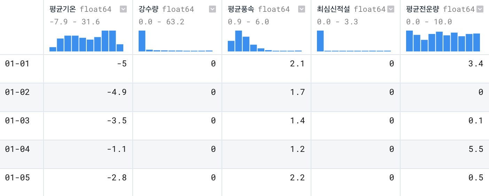
</ul>
<br>

> **1차 처리된 데이터에서 한글 목차를 영어로 변환**

```python
def rename_kor_to_eng(origin_df) -> pd.DataFrame:

    renamed_df = origin_df.copy()

    en_dictionary = dict() # 딕셔너리 내용 생략

    renamed_df.rename(columns=en_dictionary, inplace=True)
    renamed_df.index.name = 'date'

    en_categories = list(en_dictionary.values())
    en_categories = [en_categories[0]] + sorted(en_categories[1:])
    renamed_df = renamed_df.reindex(columns=en_categories)

    return renamed_df
```

<ul>
    <li>해당 함수는 배달 데이터 전처리 과정에서 사용한 한영 변환 함수와 동일</li>
    <li>한글 데이터프레임 사본의 목차를 미리 지정한 한영 사전과 매칭시켜 변환</li>
    <li>한글 순으로 정렬된 목차를 영어 순서대로 정렬하고 반환</li>
    <br>
    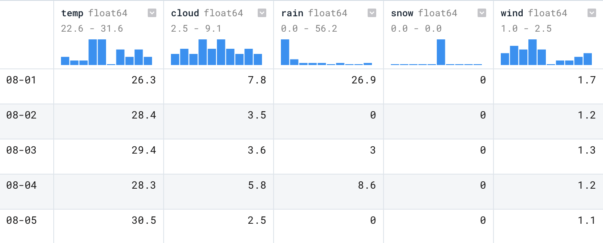
</ul>

---

### 3-4. 데이터 요청 함수 생성

<br>

> **배달 데이터 요청 함수**

```python
def get_dataframe(year, start_date, end_date, directory) -> pd.DataFrame:

    original_delivery = pd.read_csv(f'{directory}KT_DLVR_{year}.csv', encoding='utf-8')

    seoul_delivery = make_seoul_delivery(original_delivery, start_date, end_date)
    sum_delivery = pd.pivot_table(seoul_delivery, index=['일자'], aggfunc=np.sum)
    sum_delivery.rename(columns={'주문횟수':'총주문횟수'}, inplace=True)
    delivery_categories = sorted(list(set(seoul_delivery['분류'])))

    counted_delivery = count_by_category(seoul_delivery, sum_delivery, delivery_categories)

    try:
        del counted_delivery['배달전문업체']
    except KeyError:
        pass
    try:
        del counted_delivery['야식']
    except KeyError:
        pass

    counted_delivery_en = rename_kor_to_eng(counted_delivery)

    return counted_delivery_en
```

- 다른 주피터 노트북 파일에서 배달 데이터를 쉽게 불러오기 위해 별도의 함수 생성
- 함수는 (1)연도, (2)시작 일자, (3)종료 일자, (4)디렉토리 경로를 받음
- 원본 데이터를 읽어와서 1차, 2차, 그리고 최종 전처리 과정을 순서대로 진행
- 2차 전처리 함수에서 필요한 매개변수를 해당 함수에서 생성하고, 불필요한 열도 별도로 제거
- 모든 전처리 과정을 거친 데이터프레임을 반환

<br>

> **날씨 데이터 요청 함수**

```python
def get_dataframe(year, start_date, end_date, directory) -> pd.DataFrame:

    original_weather = pd.read_csv(f'{directory}WEATHER_{year}.csv', encoding='utf-8')

    weather = clean_up_data(original_weather, start_date, end_date)

    weather_en = rename_kor_to_eng(weather)

    return weather_en
```

- 다른 주피터 노트북 파일에서 날씨 데이터를 쉽게 불러오기 위해 별도의 함수 생성
- 해당 함수는 배달 데이터 요청 함수와 구조적으로 동일
- 원본 데이터를 읽어와서 1차와 최종 전처리 과정을 순서대로 진행
- 특별한 후처리 없이 결과 데이터프레임을 반환

<br>

> **데이터 불러오기 예시**

```python
from delivery_data import get_dataframe as get_delivery
from weather_data import get_dataframe as get_weather

delivery = get_delivery('2019', '08-01', '08-30', 'original_data/')
weather = get_weather('2019', directory='original_data/')
```

---
---

## 4. 데이터 시각화

### 4-1. 배달 데이터 시각화

<br>

> **일자 별 총주문횟수에 대한 막대그래프**

```python
plt.figure(figsize = (20, 10))

sns.set(style="whitegrid", color_codes=True)

sum_ax = sns.barplot(data=delivery, x="date", y="sum", palette="Greens_d", hue="sum", dodge=False)
sum_ax.legend_.remove()

plt.show()
```

- `seaborn` 막대 그래프 사용

<br>

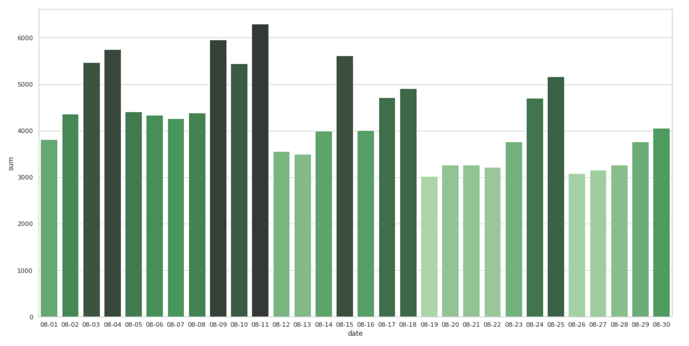

<br>

> **모든 분류에 대해, 각각의 일자 별 주문횟수에 대한 막대그래프**

```python
delivery_fig, delivery_axes = plt.subplots(4, 4, figsize=(24,10))
delivery_fig.suptitle('Delivery Counts - 4 x 4 axes')

for i in range(4):
    for j in range(4):
        ax = delivery_axes[i, j]
        food = str(delivery_array[i, j])

        if food in {'date', 'sum'}:
            break

        sns.barplot(ax=ax, data=delivery_day, x='date', y=food, \
                    palette='Blues_d', hue=food, dodge=False)
        ax.set(title=food, xlabel=None, ylabel=None, xticklabels=[])
        ax.legend_.remove()

delivery_axes[3, 2].set(xticklabels=[])
delivery_axes[3, 3].set(xticklabels=[])

plt.tight_layout()
plt.show()
```

- `matplotlib`의 `subplots()`로 표현한 4x4 그리드 위에 `seaborn`의 막대 그래프 표시
- 단일 막대그래프를 여러 개 표시하는게 좋다고 판단하여 해당 그래프 사용 안함

<br>

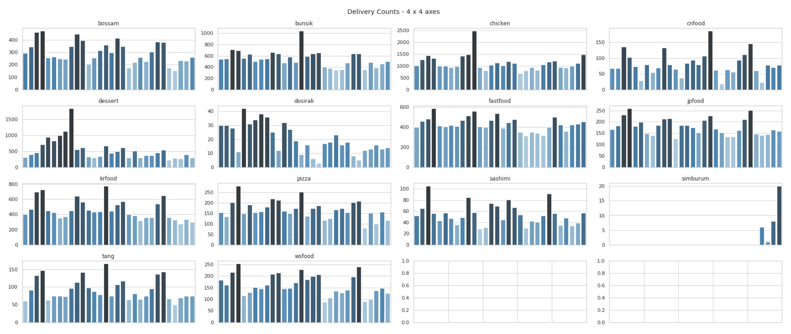

---

### 4-2. 날씨 데이터 시각화

<br>

> **평균온도 그래프와 평균온도 변화량 그래프 비교**

```python
plt.plot(np.diff(weather['temp']))
plt.plot(weather['temp'])
plt.show()
```

<ul>
    <li><code>matplotlib</code>의 기본 <code>plot()</code> 함수 사용</li>
    <li><code>np.diff()</code> 함수는 전날 대비 평균온도 변화량을 반환</li>
    <li>평균온도 그래프는 주황색, 평균온도 변화량 그래프는 파란색</li>
    <li>온도는 변화량보다 측정치가 더 직관적이라 판단하여 평균온도 그래프 선택</li>
    <br>
    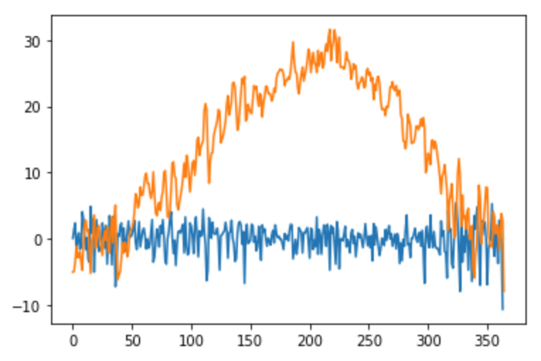
</ul>
<br>

> **일강수량 그래프와 일강수량 변화량 그래프 비교**

- `matplotlib`의 기본 `plot()` 함수 사용
- `np.diff()` 함수는 전날 대비 일강수량 변화량을 반환
- 일강수량 그래프는 주황색, 일강수량 변화량 그래프는 파란색
- 강수량은 변화량이 더 직관적이라는 의견이 많았지만,   
  이미 일강수량 그래프로 진행하던 상태여서 기존 선택 유지

```python
plt.plot(np.diff(weather['rain']))
plt.plot(weather['rain'])
plt.show()
```

<ul>
    <li><code>matplotlib</code>의 기본 <code>plot()</code> 함수 사용</li>
    <li><code>np.diff()</code> 함수는 전날 대비 일강수량 변화량을 반환</li>
    <li>일강수량 그래프는 주황색, 일강수량 변화량 그래프는 파란색</li>
    <li>강수량은 변화량이 더 직관적이라는 의견이 많았지만,<br>이미 일강수량 그래프로 진행하던 상태여서 기존 선택 유지</li>
    <br>
    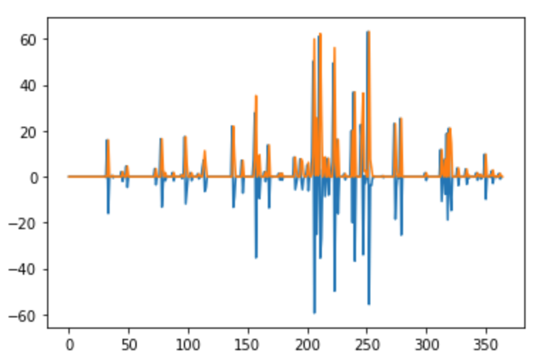
</ul>
<br>

> **평균온도 그래프와 일강수량 그래프**

- `matplotlib`의 기본 `plot()` 함수 사용
- 평균온도 그래프는 주황색, 일강수량 변화량 그래프는 파란색

```python
plt.plot(weather['rain'])
plt.plot(weather['temp'])
plt.show()
```

<ul>
    <li><code>matplotlib</code>의 기본 <code>plot()</code> 함수 사용</li>
    <li>평균온도 그래프는 주황색, 일강수량 변화량 그래프는 파란색</li>
    <br>
    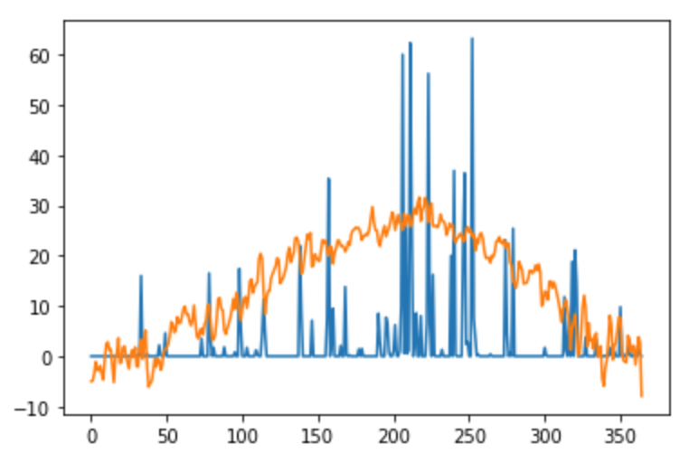
</ul>

---

### 4-3. 배달-날씨 데이터 시각화

<br>

> **배달-날씨 데이터 단일 그래프**

```python
year, month = '2019', 8
month_names = list(month_name)[1:]

common_col = 'date'
delivery_col = 'dessert'
common_label = common_col.capitalize()
delivery_label = delivery_col.capitalize()
```

```python
fig, ax1 = plt.subplots(figsize=(20,10))

tit = f'{delivery_label} in {month_names[month-1]} {year}'
plt.title(tit, fontsize=16, pad=16)

sns.barplot(ax=ax1, data=delivery, x=common_col, y=delivery_col, \
            palette="YlGn", hue=delivery_col, dodge=False)
ax1.legend_.remove()
ax1.set_xlabel(common_label, fontsize=14)
ax1.set_ylabel(delivery_label, fontsize=14)

ax2 = ax1.twinx()
ax2.plot(weather['rain'], linestyle='-', marker='o', color='#007aff', linewidth=2)
ax2.yaxis.set_ticks([])

ax3 = ax1.twinx()
ax3.plot(weather['temp'], linestyle='-', marker='o', color='#ff2d55', linewidth=2)
ax3.set_ylabel('Temp & Rain', fontsize=14)
    
plt.show()
```

- 2019년 8월 중 모든 일자에 대해 '디저트' 주문횟수와 '평균온도' 및 '일강수량' 그래프를 겹쳐서 표시
- '디저트' 주문횟수에 대한 데이터는 `seaborn` 막대 그래프로 표시
- '평균온도' 및 '일강수량' 데이터는 `matplotlib` 기본 함수로 표시
- 각각의 데이터에 대한 스케일 조정을 하지 않고 `twinx()`로 서로 다른 y축을 생성해서 분리
- `twinx()`는 기존 그래프와 x축을 공유하는 새로운 평면을 생성하는 함수
- '평균온도' 및 '일강수량' 그래프는 값을 직관적으로 보이기 위해 꺾은선 그래프로 표시

<br>

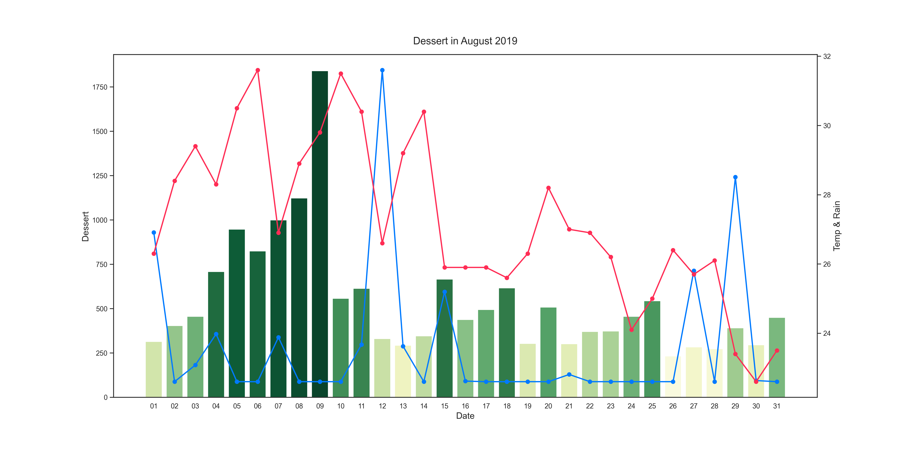

<br>

> **월별 배달-날씨 데이터 그래프 수집**

```python
# 월별 데이터프레임 리스트 생성 부분 생략

delivery_cols = delivery_list[0][0].columns.tolist()[1:]
month_names = list(month_name)[1:]

year_zip = zip(delivery_list, weather_list, year_list, month_list)

for delivery_month, weather_month, year, month_range in year_zip:

    month_zip = zip(delivery_month, weather_month, month_range)

    for delivery_df, weather_df, month in month_zip:

        for delivery_col in delivery_cols:

            # 배달-날씨 데이터 단일 그래프 생성 코드

            filename = f'{year}{month}_{delivery_label}'
            plt.savefig(f'images/{filename}.png', dpi=300)
```

- 모든 연도에 대한 데이터프레임을 월별로 분리하고 각각의 데이터프레임에 대해 그래프 생성
- 그래프는 추가로 음식 '분류' 별로도 나눠지며 각각의 그래프를 그림 파일로 저장

---
---

## 5. 그래프 분석

### 5-1. 그래프 분석 포인트
- 평균온도와 배달 주문횟수 간에 상관관계가 있는가?   
  (날씨가 너무 덥거나 추우면 배달 주문횟수가 증가할 것으로 예상)
- 일강수량과 배달 주문횟수 간에 상관관계가 있는가?   
  (비가 오면 배달 주문횟수가 증가할 것으로 예상)

---

### 5-2. 상관관계가 있는 그래프
- 전체적으로 다음과 같이 어느정도 예상을 따르는 그래프들이 존재

<br>

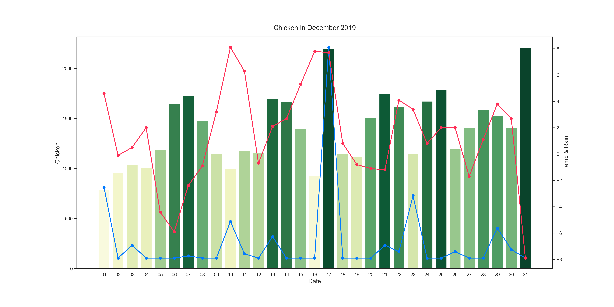

<br>


---

### 5-3. 상관관계가 없는 그래프
- 반면에 예상과는 전혀 다른 결과를 보여주는 그래프들도 존재

<br>

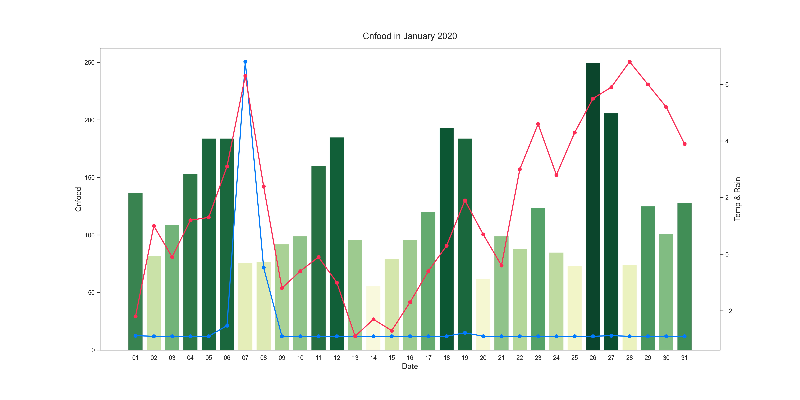

<br>

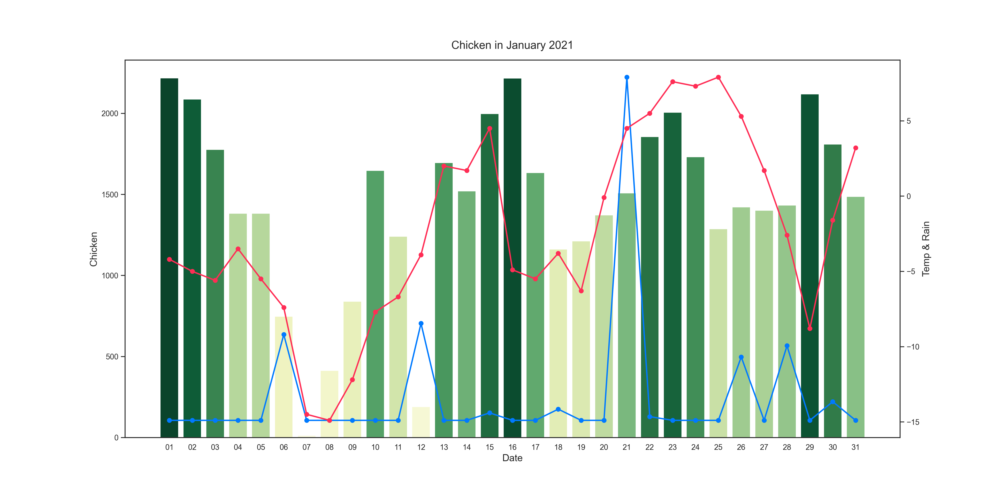

---

### 5-4. 결측치가 있는 그래프
- 특정 기간에 결측치가 있는 그래프도 존재

<br>

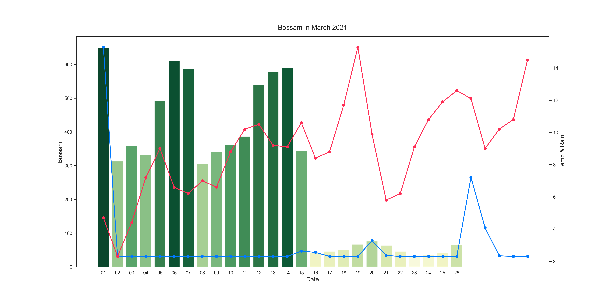

---
---

## 6. 상관관계 분석

## 6-1. 분석용 데이터 전처리

> **온도 구간에 따라 날씨 데이터 분리**

```python
hot_temp, cold_temp = 20.0, 5.0
warm_days, hot_days, cold_days = [], [], []
weather_warm_list, weather_hot_list, weather_cold_list = [], [], []

for weather_df in weather_list:
    weather = weather_df.copy()
    
    warm_days.append(weather[ (weather['temp'] <= hot_temp) & \
                                 (weather['temp'] >= cold_temp) ].index.tolist())
    hot_days.append(weather[ weather['temp'] > hot_temp ].index.tolist())
    cold_days.append(weather[ weather['temp'] < cold_temp ].index.tolist())

    weather_warm_list.append(weather[ (weather['temp'] <= hot_temp) & \
                                         (weather_df['temp'] >= cold_temp) ].copy())
    weather_hot_list.append(weather[ weather['temp'] > hot_temp ].copy())
    weather_cold_list.append(weather[ weather['temp'] < cold_temp ].copy())
```

- 더운 날의 최저온도와 추운 날의 최고온도 지정
- 해당 구간에 속하는 일자들을 추출해서 각각의 온도별 리스트로 생성
- 해당 구간에 속하는 데이터들을 추출해서 각각의 온도별 날씨 데이터 생성

<br>

> **온도 구간에 따라 배달 데이터 분리**

```python
delivery_warm_list, delivery_hot_list, delivery_cold_list = [], [], []

temp_zip = zip(delivery_list, warm_days, hot_days, cold_days)

for delivery_df, warm_day, hot_day, cold_day in temp_zip:
    delivery_warm_list.append(delivery_df.loc[warm_day].copy())
    delivery_hot_list.append(delivery_df.loc[hot_day].copy())
    delivery_cold_list.append(delivery_df.loc[cold_day].copy())
```

- 온도 구간 별 일자에 속하는 데이터들을 추출해서 각각의 온도별 배달 데이터 생성

---

### 6-2. 이항 검정
- 실패한 내용...

---

### 6-3. 산점도 분석

> **연도별 산점도 분석**

```python
total_year_list = []

for delivery_df, weather_df in zip(delivery_list, weather_list):
    total_year_list.append(delivery_df.join(weather_df))
```

```python
color_map = ['#007aff', '#ff9500', '#ff2d55']
total_year_zip = zip(range(3), total_year_list, year_list, color_map)

total_fig, total_axes = plt.subplots(3, 1, figsize=(24,10))
total_fig.suptitle('Sum-Temp - 3 x 1 axes')

for i, total_year, year, color in total_year_zip:

    sns.regplot(ax=total_axes[i], x="temp", y="sum", data=total_year, color=color)

    total_axes[i].set(title=f'{year} Sum-Temp')

plt.tight_layout()
plt.show()

```

- 연도별 배달 데이터와 날씨 데이터를 합친 새로운 데이터프레임 생성
- 3x1 사이즈의 `subplots`을 생성하고 각각의 구역에 `regplot` 표시
- `regplot`을 통해 평균온도와 총주문횟수 간의 분포를 분석
- 너무 덥거나 추운 날에 배달주문이 증가한다 가정했기 때문에 해당 그래프는 직관적이지 않음

<br>

![연도별-산점도]

<br>

> **온도별 산점도 분석**

```python
total_fig, total_axes = plt.subplots(3, 3, figsize=(24,10))
total_fig.suptitle('Sum-Temp - 3 x 3 axes')

for i, year in zip(range(3), year_list):

        sns.regplot(ax=total_axes[i, 0], x="temp", y="sum", data=total_cold_list[i], color='#007aff')
        sns.regplot(ax=total_axes[i, 1], x="temp", y="sum", data=total_warm_list[i], color='#ff9500')
        sns.regplot(ax=total_axes[i, 2], x="temp", y="sum", data=total_hot_list[i], color='#ff2d55')

        total_axes[i, 0].set(title=f'{year} Cold Days')
        total_axes[i, 1].set(title=f'{year} Warm Days')
        total_axes[i, 2].set(title=f'{year} Hot Days')

plt.tight_layout()
plt.show()
```

- 연도별 배달 데이터와 날씨 데이터를 온도 구간 별로 나눈 데이터프레임 활용
- 3x3 사이즈의 `subplots`을 생성하고 각각의 구역에 `regplot` 표시
- 온도 구간에 따른 주문량 변화를 직관적으로 확인할 수 있었음

<br>

![온도별-산점도]

---
---

## 7. 분석 결과


